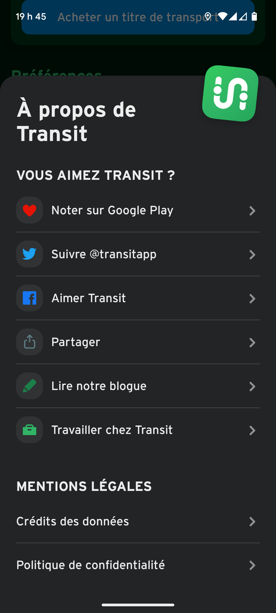

MONA vous aide à decouvrir l'art public et les lieux culturels au Québec. C'est un projet libre et open source.

Vous aimez MONA?

 Noter sur Google Play

 Suivre @MONA.artpublic

    - 

 Aimer MONA

    - « Aime » sur facebook

 Partager

    - Ouvrir un dialogue modal qui permet le partage par texte, courriel, etc 

 Apprendre davantage 

MONA est produit par la Maison MONA, un organisme à but non lucratif basé à Montréal (Québec, Canada). Les données que nous recueillons servent uniquement à la recherche académique. Ce projet entièrement non-commercial n'implique aucun tiers.

Vous voulez en savoir plus ? Visiter notre [site web](https://monamontreal.org/index.html)

### Mentions Légales
- [Crédits des données](creditsdesdonnees.md)
- [Licences](licences.md)
- [Politique de confidentialité](politiquedeconfidentialite.md)

## Exemple de l'app Transit

{:height="36" width="36"}