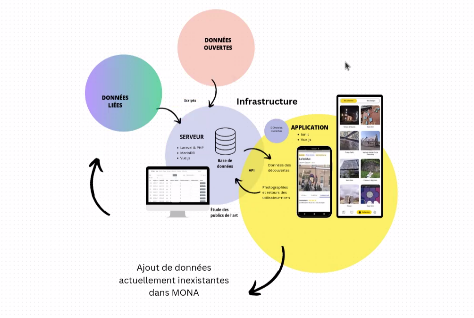

<link rel="shortcut icon" type="image/x-icon" href="favicon.ico?">

## **Automne 2024** - Tiffany M

### <a name="description-du-stage"></a>Description du stage
Durée : 6 mois à temps plein

Professeur superviseur : Benoit Baudry DIRO UdeM


Pendant ce stage, je voudrais développer et approfondir mes connaissances de l'univers Wiki, l'art public, le partage des connaissances, l'approvisionnement par la foule («crowd-sourcing»), la langue française, et le développement des applications mobiles.

<a href="Description_du_stage_16sep2024.pdf" target="_blank">Description initiale du stage en PDF</a>


## <a name="rapports-hebdomadaires"></a>Rapports hebdomadaires


<details>
<summary>semaine 1 (16 septembre) 
</summary>


Cette semaine, j'ai participé à divers réunions et ateliers et je me suis engagée dans un cheminement pour m'intégrer dans une organisation en plein essor qui fonctionne à but non lucratif. J'adore qu'elle travaille ouvertement par défaut, et je pense que cette pratique m'aidera dans les semaines à venir quand je cherche de l'information d'une façon autonome.

J'ai également pris mes premiers pas en tant que wikimédienne en devenir.

De plus, j'ai :
- assisté à une réunion avec mon professeur superviseur Benoit Baudry pour discuter le projet
- assisté à la **Matinée numérique #7**
  - au programme de la Matinée :  
    - Présentation du projet ArtIA de Sporobole - par Éric Desmarais
    - L'intelligence artificielle en culture : défis et opportunités - par Christophe Prévost (MCCQ)
    - Les données descriptives au ministère : historique et vision - par Alexandre Naud (MCCQ)
- assisté à l'atelier **wiki Ada X** à la Cinémathèque québécoise
  - créer mon compte Wikipédia
  - faire ma première contribution à Wikipédia
- assisté à l'atelier **Faire la différence: parler et écrire un français inclusif** offert par l'UdeM
  - appris l'existence du site web qui aide à trouver les mots inclusifs [https://eninclusif.fr/](https://eninclusif.fr/)
- appris l'existence de la _Politique d'intégration des arts à l'architecture et à l'environnement des bâtiments et des sites gouvernementaux et publics_
  - 1% des fonds dédiés à l'art public
</details>
<details>
<summary>semaine 2 (23 septembre)</summary>

Cette semaine, je suis toujours en train de me familiariser avec les projets et outils de l'équipe.  J'ai rencontré des membres de l'équipe Tech, et j'ai continué mon progrès avec l'univers Wiki.

J'aime bien le fait qu'«ici, on fait des décisions à deux».  Cela en dit long sur la structure horizontale de l'organisation.

De plus, j'ai :
- assisté à une réunion avec Lena pour apprendre quels outils on utilise chez MONA
  - ici on fait les décisions à deux
  - outils et logiciels
    - zoterom
    - typora
    - pcloud
    - clickup
    - zettlr
    - github
    - google cloud
    - hackmd.io 
- assisté à une réunion avec Lena et Camila pour deviner plus familière avec l'organisation
- assisté à une réunion Tech Team et rencontrer les autres membres de l'équipe tech :  
  -  Corélie qui travaille sur l'interface admin
  -  Sarah qui travaille sur l'application
  -  Simon qui travaille sur le serveur et avec les données ouvertes
- discuté la situation mobilière du bureau
- créé des comptes pour les outils
- commencé les rapports hebdomadaires
- assisté à la [Journée pratique Wikimédia commons](https://hackmd.io/qWy3pnbnSjCaSAE1m9Wn4Q#Journ%C3%A9e-pratique-Wikimedia-commons) le 26 septembre
</details> 
<details>   
<summary>semaine 3 (30 septembre)</summary>

Cette semaine, je suis allée à Sherbrooke pour assister à l'atelier wiki MONA x Sporobole.  La présence des vrai·e·s artistes à l'atelier qui montraient leur intérêt m'a donné un sens de l'utilité concrète d'acquérir des connaissances sur le processus d'ajout sur Wikimédia et Wikipédia.

De plus, j'ai :
- assisté à la réunion essaie pour l'atelier wiki
- transféré la liste de références pour les artistes Lucie Duval et Cécile Gariépy [en zotéro](https://www.zotero.org/groups/5110127/communs-numeriques/collections/8WCS6TZ2)
- assisté à l'atelier wiki MONA x Sporobole à Sherbrooke
  - funfact: une licence qui inclut l'utilisation du contenu pour une visée marchandise est due aux clés USB Wikipédia qui sont vendus au pays qui ont un accès limité à l'Internet
- pris des photos à Sherbrooke
- ajouté l'œuvre [Mémoire vive de Lucie Duval sur Wikidata](https://www.wikidata.org/wiki/Q130419921), et ajouté [sa photo sur Wikimédia commons](https://commons.wikimedia.org/wiki/File:M%C3%A9moire_vive_sculpture_de_Lucie_Duval.jpg)
- assisté à l'atelier **Faire bonne impression en 30 secondes** offert par l'UdeM
</details>   
<details>
<summary>semaine 4 (7 octobre)</summary>

Cette semaine, j'ai :
- lu [les notes de direction technique](https://hackmd.io/@MONAmtl/dir-tech#Dir-Tech)
- lu sur [Wikimedia global account](https://meta.wikimedia.org/wiki/Help:Unified_login)
- lu [Vers un commun numérique de l’art public](https://sens-public.org/dossiers/1759/)
- créé [ma page d'utilisateur meta-wiki](https://meta.wikimedia.org/wiki/User:Anthraciter)
- ajouté ces images sur wikimedia pour l'artiste [Zema](https://www.wikidata.org/wiki/Q124846279)
  de [cette oeuvre](https://www.wikidata.org/wiki/Q130369646)
  - [image 1](https://commons.wikimedia.org/wiki/File:Sans_titre_murale_par_Zema1.jpg)
  - [image 2](https://commons.wikimedia.org/wiki/File:Sans_titre_murale_par_Zema2.jpg)
- assisté à la réunion sur LOD Export le 9 octobre avec Guy Lapalme, Camille, Lena, Simon, et David
- ajouté [l'image](https://commons.wikimedia.org/wiki/File:Cap_Tourmente_murale_par_STARE.jpg) sur wikimedia pour l'artiste [STARE](https://www.wikidata.org/wiki/Q125246059) 
  après avoir ajouté l'entrée wikidata de la murale [Cap Tourmente](https://www.wikidata.org/wiki/Q130474060)
- assisté à la réunion Tech Team le 9 octobre
- supprimé [l'image](https://commons.wikimedia.org/wiki/File:Cap_Tourmente_murale_par_STARE.jpg)
- assisté à l'atelier Wiki aime les monuments et pris des notes
- [Notes de l'atelier Wiki aime les monuments/wiki loves monuments](https://hackmd.io/voEQw1wtQACP8mVmNNkNsw)
- ajouté des images au [WikiProject Maison MONA / Vers un commun numérique de l'art public](https://commons.wikimedia.org/wiki/Category:WikiProject_Maison_MONA_/_Vers_un_commun_num%C3%A9rique_de_l%27art_public) selon [cette liste](https://docs.google.com/spreadsheets/d/1fnXGMW8w151W8noCN_ypaFl5SIUo7fUM1Xf-DuDkjP0/edit?usp=sharing) 
</details>
<details>
<summary>semaine 5 (14 octobre)</summary>

Aujourd'hui, quand j'ai commencé à cataloguer les types des champs dans les données ouvertes de la ville de Rimouski, j'ai compris un peu plus le sentiment que Lena a exprimé il y a quelques semaines par rapport à être bergère/protectrice/gardienne des données.  À un moment, j'ai essayé de confirmer un titre inédit qui semblait coupé (le titre c'était «Cette histoire est vraie parce que je l’» de Gilles Pitre), et je n'ai rien trouvé.  J'étais un peu triste, car je savais que cet enregistrement du titre pourrait être l'un des seuls qui existent sur Internet. 

Cette semaine, j'ai également :
- commencé à [Définir les types dans les sources de données](https://hackmd.io/@tiffanym/definir-types)
- assisté à la réunion de préparation pour [WikiConvention francophone](https://meta.wikimedia.org/wiki/WikiConvention_francophone)
- assisté à la réunion Tech Team le 16 octobre
- ajouté des phrases complètes à mes rapports hebdos initials
- appris comment ajouter les «accordions» en markdown
- investigué le fonctionnement du markdown des pages github.io
  - le markdown github (GLM) diffère d'autres [« saveurs » de markdown](https://github.com/commonmark/commonmark-spec/wiki/Markdown-Flavors)
- lu de l'info sur les formats possibles des coordonnées géographiques et les projections
- cherché la référence spatiale utilisée par [la liste des oeuvres en Saint-Roch](https://www.ville.quebec.qc.ca/citoyens/art-culture/art-public/repertoire/secteur-06.aspx) dans les fichiers sources de [la carte interactive d'une oeuvre](https://carte.ville.quebec.qc.ca/mobile?z=9&x=249739.878&y=5186556.635) sur cette liste
- ajouté 4 images au [WikiProject Maison MONA / Vers un commun numérique de l'art public](https://commons.wikimedia.org/wiki/Category:WikiProject_Maison_MONA_/_Vers_un_commun_num%C3%A9rique_de_l%27art_public) : 
    - [Duo-Denum de Danaé Brissonet](https://commons.wikimedia.org/wiki/File:Duo-Denum_murale_de_Dana%C3%A9_Brissonnet_01.jpg) et [2](https://commons.wikimedia.org/wiki/File:Duo-Denum_murale_de_Dana%C3%A9_Brissonnet_02.jpg)  
    - [Flourishing farm de Borrris](https://commons.wikimedia.org/wiki/File:Flourishing_farm_murale_de_Borrris.jpg)
    - [Cap Tourmente de STARE](https://commons.wikimedia.org/wiki/File:Cap_Tourmente_murale_de_STARE.jpg)
    - [Bgirls de Miss Wuna](https://commons.wikimedia.org/wiki/File:Bgirls_murale_de_Miss_Wuna.jpg)
    - [L'ange de Bordeaux d'Awie](https://commons.wikimedia.org/wiki/File:L%27ange_de_Bordeaux_murale_d%27Awie.jpg)
    - [Un vent de liberté de Mélany Fay](https://commons.wikimedia.org/wiki/File:Un_vent_de_libert%C3%A9_murale_de_M%C3%A9lany_Fay.jpg) et [2](https://commons.wikimedia.org/wiki/File:Un_vent_de_libert%C3%A9_murale_de_M%C3%A9lany_Fay-2.jpg)
- appris que les templates {{Art Photo}} du wikimédia commons exigent que la nature de l'objet est oeuvre d'art afin d'afficher le cadre de l'objet avec les liens vers les fiches wikidata
- défini les types dans les données d'artpublic Rimouski
- examiné les données d'artpublic Rimouski
- appris que les pivot tables [tableaux croisés dynamiques](https://www.btb.termiumplus.gc.ca/tpv2alpha/alpha-eng.html?lang=eng&i=1&srchtxt=pivot+table&codom2nd_wet=1#resultrecs) ne sont pas sensible à la casse [comme décrit ici](https://bugs.documentfoundation.org/show_bug.cgi?id=140510)
- continué à [Définir les types dans les sources de données](https://hackmd.io/@tiffanym/definir-types)
- testé la nouvelle version de l'application mobile et donné des commentaires à Sarah
  - bug avec "/defined" sur la page des Badges
  - l'ordre de ma collection est changé 
  - les images de badge sont identiques pour le Sud-Ouest et l'université de Montréal
</details>

<details>
<summary>semaine 6 (21 octobre)</summary>

### côté WikiProject Maison MONA / Vers un commun numérique de l'art public

Pour me préparer à la relecture de la partie anglaise de notre WikiProject, j'ai regardé des pages d'autres WikiProjects pour alimenter mon cerveau avec la syntaxe anglaise pour parler des projets sur wiki, et j'ai remarqué que quelques-uns ont inclus des liens vers des SPARQL queries qui réfèrent à leurs données.  J'ai trouvé un projet qui pourrait bien servir comme modèle.

J'ai ajouté les onglets à [la page pour le WikiProject Maison MONA / Vers un commun numérique de l'art public](https://www.wikidata.org/wiki/Wikidata:WikiProject_Maison_MONA_/_Vers_un_commun_num%C3%A9rique_de_l%27art_public) à l'instar de [ce projet : WikiProject Neighborhood Public Art in Boston](https://www.wikidata.org/wiki/Wikidata:WikiProject_Neighborhood_Public_Art_in_Boston)

- **Accueil**
- **Modèles de données** (j'ai fait les traductions de mon mieux)
- **Requêtes** (adapté pour utiliser P6104 au lieu de P5008; je suggère d'aller voir les listes créées par l'outil externe TABernacle, c'est étonnant à mon avis, voici [un lien](https://tabernacle.toolforge.org/?#/tab/sparql/select%20%3Fitem%20where%20%7B%20hint%3AQuery%20hint%3Aoptimizer%20%22None%22.%20%3Fitem%20wdt%3AP6104%20wd%3AQ122764837%3B%20wdt%3AP31%20wd%3AQ838948.%20%7D/Len%3BDen%3BP31%3BP571%3BP170%3BP131%3BP276%3BP6375%3BP625%3BP186%3BP180%3BP576%3BP18) pour la liste des oeuvres)
- **Liste des oeuvres** (Wikilist générée automatiquement, j'ai ajouté P6104 pour le projet où cela manquait aux oeuvres afin d'avoir un critère de recherche dans la requête SPARQL)
- **Liste des artistes** (Wikilist générée automatiquement, j'ai ajouté P6104 pour le projet où cela manquait aux artistes afin d'avoir un critère de recherche dans la requête SPARQL)
- **Bibliographie** (ça vient du zotero [1. Wikidata et la création de données biographiques](https://www.zotero.org/groups/5110127/communs-numeriques/collections/GTM97UFJ) )

J'ai fait quelques changements à [la description du projet en anglais](https://www.wikidata.org/wiki/Wikidata:WikiProject_Maison_MONA_/_Vers_un_commun_num%C3%A9rique_de_l%27art_public).  Mon choix du mot  «equity-denied» dans la partie Wikidata, est basé sur [ce document du gouvernement fédéral](https://www.noslangues-ourlanguages.gc.ca/en/publications/equite-diversite-inclusion-equity-diversity-inclusion-eng?view_mode=bilingual#notion-99335) qui parle des différences entre
- equity-denied group (proposal, noun phrase)
- equity-deserving group (noun phrase)
- equity-seeking group (noun phrase)

Il y avait un problème avec la fiche wikidata de Sophie Wilkins.
J'ai enlevé, puis publié à nouveau le template {{Art photo}} pour forcer un rafraîchissement et Sophie Wilkins de 1976 apparaît maintenant dans la fiche de l'oeuvre 1.

La prochaine fois qu'on remarque que l'info liée au template n'a pas changé comme prévu, on peut essayer une Modification nulle (null edit) décrite sur la page [Purge du cache](https://fr.wikipedia.org/wiki/Aide:Purge_du_cache)
j'ai appris que cette option existait grâce à [MediaWiki: How do I force MediaWiki to update a certain Category:XXX page?](https://webmasters.stackexchange.com/a/78448)

Cette semaine, j'ai également :
- trouvé [cette page](https://www.wikidata.org/wiki/Wikidata:Autobiography/fr)  qui s'aligne bien avec une discussion sur les auto-modifications de fiches wikidata par des artistes, notamment:

> En général, sur Wikidata, il est permis de modifier votre propre Élément de données.
- envoyé des requêtes de suppression pour les fichiers de Zema qui a changé d'idée sur le partage
- envoyé une requête de changement de nom pour le fichier [Bgirls murale de Wüna](https://commons.wikimedia.org/wiki/File:Bgirls_murale_de_W%C3%BCna.jpg)
- essayé d'écrire une requête SPARQL qui pourrait trouver les artistes sur wikidata, mais elle a toujours fini en «timed-out»
- révisé [la version anglaise de la description du WikiProject](https://www.wikidata.org/wiki/Wikidata:WikiProject_Maison_MONA_/_Vers_un_commun_num%C3%A9rique_de_l%27art_public#%7B%7BTranslateThis_%7C_fr_%3D_Liste_des_artistes_%7C_en_%3D_Artists_%7D%7D)
- ajouté une référence vers [Wikidata:WikiProject Neighborhood Public Art in Boston](https://www.wikidata.org/wiki/Wikidata:WikiProject_Neighborhood_Public_Art_in_Boston) à la [liste zotero ](https://www.zotero.org/groups/5110127/communs-numeriques/collections/GTM97UFJ)et à [la bibliographie du projet MONA](https://www.wikidata.org/wiki/Wikidata:WikiProject_Maison_MONA_/_Vers_un_commun_num%C3%A9rique_de_l%27art_public/Bibliographie) et j'ai demandé à David s'il y a une convention différente pour reconnaître les autres WikiProjects

### côté chasse à Saint-Roch


J'ai commencé la page wiki pour la chasse aux photos de Saint-Roch pour l'InstitutWikiGLAMU.  Les coordonnées étant dans un format non reconnu par OpenStreetMap (EPSG:32187), j'ai cherché et essayé plusieurs façons de les convertir. J'ai fais mes premiers pas avec le logiciel intimidant QGIS et j'ai réussi à faire une conversion, grâce aux consignes sur [stackexchange](https://gis.stackexchange.com/a/64543).  Maintenant il faut les vérifier.

J'ai créé [cette carte](https://margelle.github.io/rapportMONA/carte-saint-roch.html) et aussi commencé [cette page d'utilisateur wiki pour Saint-Roch](https://meta.wikimedia.org/wiki/User:Anthraciter/SaintRoch).  Pendant que je faisais mes premiers essais, j'ai eu le sentiment de marcher dans la boue avec le format wiki et le surplus d'information nécessaire pour faire la moindre chose.

Je voudrais intégrer la carte pour les oeuvres de Saint-Roch directement sur la page wikimedia, alors j'ai commencé à apprendre les templates avec [ce tutoriel](https://meta.wikimedia.org/wiki/Learning_patterns/Doing_more,_with_templates:_A_tutorial_for_Wikimedia_project_creators).
J'ai appris que les noms de templates sont sensibles à la case, sauf pour la première lettre.  J'étais curieuse par rapport à cela, parce que j'avais vu le format pour les coordonnées géographiques exprimer dans deux manières {{coord||}} et {{Coord}} alors, mystère résolu.

Cette semaine, j'ai également :

- cherché un·e par un·e les artistes du Saint-Roch sur wikidata, et j'ai heureusement retrouvé plusieurs IDs
- cherché un·e par un·e les oeuvres du Saint-Roch sur wikidata, et je n'ai rien trouvé 
- travaillé sur la liste des oeuvres du Saint-Roch avec des recherches sur Internet
- appris comment changer la couleur des épingles dans le logiciel de carte Leaflet
- appris comment faire un lien dans un wiki vers une fiche wikidata, voici un exemple de la syntaxe '[[wikidata:Q2031780|Rasputina]]' qui apparaîtra comme [Rasputina](https://www.wikidata.org/wiki/Q2031780)
- utilisé [cet outil](https://tableconvert.com/csv-to-markdown) qui transforme les fichiers csv aux tables en format markdown ou format media wiki (parmi plusieurs formats disponibles)
- regardé [cette vidéo](https://www.youtube.com/watch?v=bksdUi6bidg) sur l'oeuvre «Les petits oiseaux d’argile»
- assisté à [la réunion planning](https://hackmd.io/@MONAmtl/institut-GLAMu/edit) pour la session Institut GLAMU
- cherché les galeries wikimedia pour toutes les oeuvres et les ajouté à la liste
- divisé la liste d'oeuvres pour la chasse Saint-Roch en deux, et ajouté une colonne de distances de la bibliothèque Gabrielle-Roy
- cherché des pages wikipedia pour toutes les oeuvres sur la liste, mais je n'en ai rien trouvé

### côté app mobile et site web

J'ai rédigé l'ébauche de [la section À propos](https://hackmd.io/@tiffanym/apropos/edit) pour l'app.
J'ai aussi écrit [un autre document](https://hackmd.io/@tiffanym/changements/edit) qui explique mes changements et qui parle aussi des choses encore à travailler.
Il y a des liens dans ces documents qui mènent aux autres parties, mais je vais aussi les inclure ici, au cas où

- [Crédits des données](https://hackmd.io/@tiffanym/creditsdesdonnees/edit)
- [Licences](https://hackmd.io/@tiffanym/licences/edit)
- [Politique de confidentialité](https://hackmd.io/@tiffanym/politiquedeconfidentialite/edit)

J'ai préparé [ce brouillon](https://hackmd.io/@tiffanym/creditsdesdonneessiteweb/edit) sur les données pour le site web.

J'ai utilisé [ce site de la collection des données de Rijksmuseum](https://www.rijksmuseum.nl/en/research/conduct-research/data/overview) comme modèle (en anglais ou néerlandais) qui était tiré de [cette liste sur github d'APIs publics sur l'art et design](https://github.com/public-api-lists/public-api-lists?tab=readme-ov-file#art--design)

Cette semaine, j'ai aussi :

- regardé la forme du document [Licences](https://hackmd.io/@tiffanym/licences/edit) et essayé de trouver quelles choses doivent être incluses dans cette partie pour les apps open source
- ajouté une phrase à la [Politique de confidentialité](https://hackmd.io/@tiffanym/politiquedeconfidentialite/edit)
- assisté à la réunion design avec Barbara et discuté la page à propos
- fait une session de débogage avec Sarah sur Zoom pour essayer de déboguer la présence du mot undefined sur l'onglet Badges dans l'app
- fait des premiers pas avec adb shell, et essayé de créer moi-même une copie de l'apk avec le drapeau debuggable=true dans AndroidManifest.xml (pas réussi à cause de processus package signing, je devais manqué une étape)

</details>

<details>
<summary>semaine 7 (28 octobre)</summary>

### côté WikiProject Maison MONA / Vers un commun numérique de l'art public

J'ai lu les notes de présentation qui étaient préparées pour Québec et ajouté quelques commentaires. 

### côté chasse à Saint-Roch

J'ai vérifié les coordonnées et corrigé quelques-unes. J'ai déplacé les murales et le collage vers la liste d'œuvres avoisinantes.  J'ai changé la couleur des épingles selon le groupe, et j'ai mis à jour la carte.  J'ai aussi ajouté la géolocalisation. 
J'ai ajouté la colonne Wikipedia à la table d'œuvres.

### côté app mobile et site web

J'ai regardé la nouvelle release interne et transmis mes commentaires sur le fonctionnement des filtres en combinaison avec barre de recherche à Sarah.  Je lui ai aussi indiqué quelques changements suggérés pour les boutons superposés dans le tutoriel et le manque du mot «un» dans la description du projet.

### Institut WikiGLAMU

J'ai assisté à la session inaugurale de [l'Institut WikiGLAMU](https://fr.wikipedia.org/wiki/Wikip%C3%A9dia:GLAM/Qu%C3%A9bec/InstitutWikiGLAMU#) où iels ont pris une approche dite « anti-conférénce »
Le terme wikipédiste (ou wikimédiste, selon la personne) est préféré au wikimédien·ne ou wikipédien·ne.
On a parlé de la force de l'intelligence collective et qu'en ouvrant sur l'univers wiki, on ouvre pour le bien commun. 
Je me demandais pendant la session si les établissements québécois qui profitent des outils et services wiki contribuent à la fondation Wikimedia (avec les redevances ?). 
Dans la même veine, je me suis demandé plus tard si les fameux 4 contrôleurs français qui suppriment le contenu d'ailleurs le font par crainte de dépasser le budget annuel d'hébergement pour les serveurs.  Sinon, j'ai du mal à trouver des motivations intelligibles pour supprimer le contenu qui était ajouté à wiki de bonne foi.

### WikiConvention francophone

[Voici un lien vers le programme](https://meta.wikimedia.org/wiki/WikiConvention_francophone/2024/Programme)

Lors de la première journée, j'ai assisté aux sessions suivantes:
- Cérémonie d'ouverture
- Conférence d'ouverture
- Quelle éthique pour la contribution aux projets Wikimédia? par Anja
- Vers un commun numérique de l'art public par LixiaPF (et toute l'équipe de la maison MONA bien sûr)
- OpenStreetMap et Wikidata : créer du lien entre les données libres par PyMouss
- Créer une application mobile pour un musée avec Wikidata, Wikipédia et Kiwix par Kamen 

La deuxième journée était :
- Savoirs pluriels : wikifier les critères d'admissibilité par Seeris, Bernipède, Pixetoile, FrederiqueDube
- Lingua Libre : retour sur le projet de documentation de la diversité orale par Yug
- Les bibliothécaires québécoises et canadiennes et le fossé des genres dans Wikipédia et Wikidata par Marie D Martel
- Wikipédia pour développer des compétences plurilingues à l'université par JubEDL
- Les enjeux de la découvrabilité dans le champ des arts et des littératures numériques par Yan St-Onge
- Valoriser les patrimoines d'un territoire sur les projets Wikimédia par Lyokoï
- La diversité de genre, du grand écran à Wikipédia : des outils féministes pour contrer les biais de genre dans l'encyclopédie francophone par Synchroniseuse
- Cérémonie de clôture


  

</details>

<details>
<summary>semaine 8 (4 novembre)</summary>

On a visité le musée régional de Rimouski avec son exposition [Récits de la création du monde : Exposition bilan de la Biennale d’art contemporain autochtone 2024](https://museerimouski.qc.ca/2024/09/18/recits-de-la-creation-du-monde-exposition-bilan-de-la-biennale-dart-contemporain-autochtone-2024/).  Julie nous a montré aussi une œuvre d'art public ([Qui fait l'ange fait la bête de Lise Labrie](https://archive.nt2.uqam.ca/plepuc/fr/oeuvre/qui-fait-lange-fait-la-b-te/index.html)) qui se trouvait dans le musée en trois parties, dont une aux toilettes (les périscopes).  On n'a vu que deux des trois parties, car l'autre (un autel) était dans le bureau administratif qui n'était pas ouvert au public.
J'ai vu les œuvres [Étude des bienfaits d’une hydratation adéquate sur la productivité des gens qui mènent à bien de grands projets](https://www.artpublicrimouski.ca/oeuvre/etude-des-bienfaits-dune-hydratation-adequate-sur-la-productivite-des-gens-qui-menent-bien-de-grands-projets) (qui n'est pas dans l'app MONA) et [Ondulations](https://www.artpublicrimouski.ca/oeuvre/ondulation) (qui est dans l'app MONA) au Complexe sportif Desjardins quand j'ai cherché mon souper au café Entre-Deux.

Jeudi, je suis arrivée en avance, et j'ai eu la chance de regarder des œuvres de l'Exposition pour souligner les 10 ans de [la Galerie Léonard Parent](https://rimouski.ca/loisirs-culture/culture-patrimoine/galerie-dart-leonard-parent).  Elles étaient créées par l'équipe municipale et étaient composées de plusieurs matériaux différents. Il y avait un carnet à feuilleter et une chambre aux éclairages ultraviolets avec des peintures.

On a fait le parcours avec un plus grand groupe qui incluait des membres de l'équipe municipale et de l'équipe du Caravansérail. Pendant ce parcours, on a eu la chance de voir l'autel de Qui fait l'ange fait la bête de Lise Labrie!

À plusieurs moments pendant la semaine, je suis allée chercher les œuvres à Rimouski qui étaient épinglées dans l'application, mais je n'ai rien trouvé.  Ce serait bon d'avoir une façon d'indiquer une œuvre difficile à trouver, soit pour ajouter plus d'indices dans la fiche d'information, soit pour confirmer qu'elle a été retirée et de mettre à jour la base de données.

Voici quelques exemples que je n'ai pas réussi à trouver :
 - Quand les bateaux s'en vont de Lise Labrie
 - Non titré de André R. DuBois à 981 rue Marconi 
 - De profundis de Gilles Girard au pavillon Empress of Ireland
 - Un jardin en mémoire au Centre d'hébergement de Rimouski
 - Une berceuse pour Jonas de Lise Labrie au Centre d'hébergement de Rimouski

J'ai aussi :
  - étudié plus les données d'artpublic rimouski
  - ajouté des sources sur Cyndie Belhumeur et Patrick Bérubé pour l'atelier à [Caravansérail](https://www.caravanserail.org/) dans [zotero](https://www.zotero.org/groups/5110127/communs-numeriques/collections/Q6RVBJY7)
  - regardé le [dashboard pour l'atelier à l'Institut WikiGLAMU](https://outreachdashboard.wmflabs.org/courses/Institut_WikiGLAMU_x_Maison_MONA/Institut_WikiGLAMU) et merveillé à ce qu'on a accompli

</details>

<details>
<summary>semaine 9 (11 novembre)</summary>

J'ai assisté à la réunion Tech sur zoom avec Lena, Sarah, et Corélie.

J'ai assisté à l'assemblée de culture de la table de concertation culturelle Villeray Parc-Extension à La Cenne où Camila a présenté la Maison MONA.  On a discuté avec les gens du Cinéma Public sur leur expériences d'encourager la participation.

J'ai assisté à la grande finale 2024 du Concours L'impact Millénium Québecor où Lena et Julie a présenté la Maison MONA. Elles ont gagné le 3e prix!

J'ai parlé avec Lena sur l'usage de wikidata comme moyen de faire des changements dans les données utilisées dans l'application MONA.
Voici [un lien](https://www.figma.com/board/4RSc2qJwLTE9RMxkXIl0FU/ProjetWikidataNov2024?node-id=0-1&t=8GjveEIk50WSV3i8-1) vers l'ébauche en figma de possibilités d'intégration avec une liste de changements.
On a parlé d'exemples d'autres sites cartographiques comme https://www.queeringthemap.com/ et  https://native-land.ca/ pour avoir des idées de stratégies pour contourner les trolls et le vandalisme quand on permet les changements aux utilisateur·rices. 
On a aussi discuté le traitement des oeuvres fantômes qui ne sont plus présentes avec l'exemple [Notre existence ne sera plus jamais silencieuse. Cela nécessite ni explications, ni excuses, ni approbation](https://artpublicmontreal.ca/oeuvre/notre-existence-ne-sera-plus-jamais-silencieuse-cela-necessite-ni-explication-ni-excuse-ni-approbation/)

</details>

<details>
<summary>semaine 10 (18 novembre)</summary>

J'ai assisté à la réunion Graphisme sur zoom avec Lena, Sarah, et Barbara.  Il y a tellement de subtiles distinctions entre les gestes dans les applications, dont on est inconscient·es.

J'ai ajouté un élément wikidata pour l'oeuvre [Écho de Cyndie Belhumeur](https://www.wikidata.org/wiki/Q131283332).

J'ai ajouté des images à wikimedia pour [Écho](https://commons.wikimedia.org/wiki/File:%C3%89cho_de_Cyndie_Belhumeur.jpg) et pour [Les entrecroisements de Véronique Malo](https://commons.wikimedia.org/wiki/File:Les_entrecroisements_impression_num%C3%A9rique_sur_verre_par_V%C3%A9ronique_Malo.jpg) [cartel](https://commons.wikimedia.org/wiki/File:Les_entrecroisements_impression_num%C3%A9rique_sur_verre_par_V%C3%A9ronique_Malo_cartel.jpg)

Pendant le [Colloque international La collection est-elle une ressource ou un fardeau ?](https://cieco.co/fr/actualites/colloque-collection-ressource-2024), « Où sont les limites de l'exposable? »,  quelqu'un a indiqué qu'un client n'a pas voulu mettre les dates sur 
les cartels parce que les dates font ressembler trop aux pierres tombales, et les oeuvres representées étaient encore vivantes.

enchevêtrer (entangle)

chaque objet arrive avec backstory,
modification de l'exposition et da la pensée

Performance Specification ≈ grimoire 

Activation Reports ≈ résultat de lancer un sort
</details>

<details>
<summary>semaine 11 (25 novembre)</summary>

### touche à tout et bon à rien

Cette semaine j'ai touché à plusieurs outils technologiques, mais en tant que « touche à tout et bon à rien »
- J'ai regardé des vidéos sur SPARQL et essayé des requêtes SPARQL
- J'ai commencé à lire [la documentation sur les composables en Vue](https://vuejs.org/guide/reusability/composables)
- J'ai regardé [quelques videos](https://www.youtube.com/playlist?list=PL4cUxeGkcC9hp28dYyYBy3xoOdoeNw-hD) sur [pinia](https://pinia.vuejs.org/introduction.html), qui est un store (lieu de stockage?) pour Vue.  C'est pertinent car l'info sur les badges dans l'application MONA est stocké dans un store pinia, et il y a actuellement un bogue dans l'onglet Badges de l'app 
- J'ai essayé Chrome DevTools afin de connecter avec mon téléphone et déboguer, mais sans grand succès 
- J'ai aussi essayé d'utiliser adb, sans grand succès.  Des commandes à retenir pour plus tard

    ```
    adb bugreport

    adb shell 'logcat --pid=$(pidof -s <package_name>)'

    adb kill-server

    adb start-server

    adb shell 
    ```

- J'ai installé une copie de la base de données dans un contentant docker mariadb et y connecté avec DBeaver sur mon ordinateur.
- J'ai recherché des outils pour bien documenter les bases de données, et j'ai essayé quelques-uns comme [dbdiagram.io](https://dbdiagram.io/d/testMONA-674cf992e9daa85aca4c4a30)
and [chartdb.io](https://app.chartdb.io/diagrams/gibmwp3zggev)

J'ai fait un exercice de remue-méninges sur les requêtes SPARQL qui pourrait être utile pour les ajouts

  - liste d'éléments wikidata par distance 
    - d'emplacement actuel 
    - d'emplacement selectionné sur la carte
  - liste d'éléments wikidata par titre
    - avec fuzzy matching (correspondance approximative)
  - liste d'éléments wikidata par artiste
    - avec fuzzy matching (correspondance approximative)
  - liste d'éléments wikidata par catégorie 
    - (work of art)
      - art public
      - sculpture
      - murale

J'ai parlé avec Simon et on a commencé un SDD (document de définition du logiciel), mais la connection était mauvaise et il était difficile à comprendre.  J'aurais aimé avoir un survol du repo mona-serveur pour faciliter la documentation.

Pendant la réunion Tech, Lena a suggéré une technique très intéressante pour débloquer la résolution d'un problème :
- rédiger un courriel super formel à une personne qu'il ne faut pas décevoir avec : 
- une description détaillée du problème
- une explication des idées considérées
- un récit de démarches essayées

J'ai créé un projet github pour organiser le projet d'ajout https://github.com/orgs/MaisonMONA/projects/2, mais il en reste beaucoup de travail - il faut penser à et bien définir les étapes à venir.

J'ai téléchargé le fichier datamapping initial sur pcloud (dans MONA/Tech/Data/list_datamapping_datafiles.ods)

J'ai lu [la soumission DH2020 bisounours](https://dh2020.adho.org/wp-content/uploads/2020/07/707_MONAfrompublicarttoourartwithamobileapp.html)[^1] (ainsi dit Lena), et j'aime bien la citation “extracting culture from its symbolic and architectural shell” (Ghebaur, 2013: 709), comme si l'art public était une chose nutritive comme un œuf ou une noix et qu'il faut travailler un peu pour en obtenir

Questions soulevées :  
1. "The app's metadata is provided by Montréal and Québec's open data platforms." 

~~Pourquoi est-ce métadonnées et non juste des données ?~~  J'aurais pensé que la liste des œuvres et leurs propriétés seraient les données et l'info sur la liste (nombre d'œuvres, où les données sont hébergées, etc.) serait les métadonnées.  Sinon, est-ce que cela implique que l’on considère les œuvres elles-mêmes comme des données ? Cette perspective me ferait reconceptualiser les œuvres en tant que données. 

Après avoir lu https://en.wikipedia.org/wiki/Metadata#Definition, je comprends mieux l'usage du mot métadonnées ici, j'admets que j'avais une conception trop restreinte.   

2. "encouraging rich and critical exchanges between all citizens" 

Cette idée est très intéressante, est-ce qu'au début il y avait plus d'interactivité entre utilisateurs prévue pour l'app pour faciliter ces échanges ? 

[^1]: bisounours: enfantine ou naïve (dans ce cas, due à une commotion cérébrale)

RE: l'art public sous la loupe vs l'art public lu la soupe

On pourrait dire « laisse faire » pour "ignore me"/"disregard that"

</details>

<details open>
<summary>semaine 12 (2 décembre)</summary>

Pourquoi lappel à l'API artworks pour une seule oeuvre retourne toute une liste d'oeuvres? par.ex. https://picasso.iro.umontreal.ca/~mona/api/v3/artworks/717
retourne aussi d'autre oeuvres en lien avec l'artiste

Note: AdMare est un centre d'artistes en art actuel des Îles-de-la-Madeleine
enum 1 dans https://picasso.iro.umontreal.ca/~mona/api/v3/LODExport sources 

Il existe des logiciels du type « data catalog », comme le « data discovery and metadata engines » [Amundsen](https://www.amundsen.io/amundsen/), le plateforme métadonnées [DataHub](https://datahubproject.io/) et d'autres dans cette liste [awesome-data-catalogs](https://github.com/opendatadiscovery/awesome-data-catalogs) sur github, mais ils ont tous l'air excessif (je dirais overkill en anglais) pour notre configuration.

J'ai lu la présentation DHNB2024 (Islande) qui est sur pcloud  MONA -> CommunicationsScientifiques -> DHNB

J'ai trouvé cette tournure de phrase très apte:
"public art is art-out-of-the-museum, cultural workers involved in public art are often workers-out-of-GLAM"

Et cette partie sera pertinente pour mon projet de permettre les ajouts :

EN "while asking ourselves what we include and what we don't: how do we strike a balance between representing the artistic and cultural richness of the public space, in a way that goes beyond the restricted framework of institutional public art, while ensuring the reliability of the information and the durability of the objects we document?"

FR « en se posant la question de savoir ce qu'on inclut au final ou pas: comment équilibrer entre représenter une richesse artistique et culturelle dans l'espace public qui dépasse le cadre restreint de l'art public institutionnel, tout en s'assurant de la fiabilité de l'information et la durabilité des objets que nous documentons »

J'ai lu la présentation du Forward Linking Conference, May 6th 2024 "The challenges of semantisation in a dynamic workflow" de Camille et Simon.


RE: Documentation de données:

question pour Simon : idées de comment facilement faire la corréspondance entre API et base de données ?
</details>

## <a name="varia"></a>Varia

<p><a href="carte-saint-roch.html">carte saint roch pour la chasse aux oeuvres</a></p>

version wikimedia (Template GeoGroup ne semble pas dispo sur wikimedia)
https://meta.wikimedia.org/wiki/User:Anthraciter/SaintRoch

version wikipedia avec un lien direct vers la carte 
https://fr.wikipedia.org/wiki/Utilisateur:Anthraciter/SaintRoch

<details>
<summary>calendrier</summary>

- 24 octobre

  - 13h réunion pépi sur zoom
  - 17h30 réunion graphisme sur zoom

- 31 oct au 1 nov InstitutWikiGLAMU à Québec
- 2 nov au 3 nov wikiconvention à Québec

- 5 nov au 8 nov à Rimouski

- 11 novembre
  - 13h30 réunion Tech sur zoom

- 13 novembre 
  - 14h30 à 19h30 assister à la présentation de Camila [Les arts et la culture peuvent-ils (vraiment) être des points de jonction entre Villeray et Parc-Extension ?](https://www.facebook.com/events/579253684456451/)
  - 18h30 [La Grande finale du concours L'impact Millénium Québecor 2024](https://reseau.umontreal.ca/s/1857/bp18/interior.aspx?sid=1857&gid=2&pgid=1512#:~:text=L'Universit%C3%A9%20de%20Montr%C3%A9al%20lance,et%20se%20lancer%20en%20affaires)

- 18 novembre
  - midi réunion graphisme sur zoom

- 19 novembre
  - 16h réunion Jalon 2 mois de stage avec Benoit et Lena 

- 20 novembre
  - 10h30 réunion serveur
  - 14h30 réunion tech
  - 16h30 réunion Wiki recap

- 23 novembre
  - 13h30 Collectionner la performance déléguée. Pour une révision de l’espace muséal par Camille

</details>

<details>

<summary>à faire</summary>

### Projet de stage 

- travailler sur le projet de stage
  - préparer un état des lieux pour moissonage collectif (crowd sourcing) + filtrer de contenu
  - explorer les façons de permettre les changements, comme :
    - ajouts 
    - doublons (MONA)
    - suppressions (MONA avec drapeau)
    - corrections
    - enrichissements
    - oeuvres censurées/cachées
    - oeuvres disparues
  - faire une évaluation des conséquences, avantages/inconvénients des flux de données
  - [travailler le diagramme](https://www.figma.com/board/4RSc2qJwLTE9RMxkXIl0FU/ProjetWikidataNov2024?node-id=3-268&t=8GjveEIk50WSV3i8-1)

  

### Autre

- suggérer un titre avant la date limite de DH 2025 (le 8 décembre)
- parler avec Sarah sur le bug undefined et mentionner l'erreur de compilation VSCode
  J'ai vérifié que je n'ai pas d'erreur si j'utilise mon compte depuis l'emulateur
- faire un plus grand effort pour les rapports hebdomadaires
- ajouter les tâches au projet github
- demander à Julie de me raconter l'histoire de Sainte Bernadette liée aux îles de la Madéleine
- créer/documenter modèle des données minimal, maximal, idéal(s) selon contexte --
  Art Public Montreal sert pour le modèle maximal
- créer un document pour donner aux clients pour leur expliquer nos attentes et les définitions des données  
- (en janvier) rédiger un document collaboratif qui décrit le processus au complet flux/importation des données -> analyse des commentaires notes par les utilisateurs
- étudier les critères de notoriété de wikidata https://www.wikidata.org/wiki/Wikidata:Notability/fr
- toujours ajouter l'information que j'ai partagée sur Element et les raisonnements derrières ici dans le rapport
- toujours ajouter aux rapports les choses apprises, inspirées, creusées
- [liste de lectures](https://hackmd.io/@MONAmtl/dir-tech#Rencontre-Tiffany)
- lecture: [Message commons artiste](https://hackmd.io/ahLyaWuST5iY3t2pB-GBDw)
- suivre [le tutoriel sur protegé](https://www.iro.umontreal.ca/~lapalme/ift6281/OWL/EtapesCreationOntologie.html)
- lire intro et section 2 Feminist in a Software Lab; section 1 tries to create links where they don't exist
- ne pas regarder CIDOC CRM (orienté événement)
- ajouter trace d'accès en interface admin?
- rapport de reception Rimouski
- relire et ajout commentaires sur senspublic
- relire et ajout commentaires rapport de reception Concordia
- appprendre plus sur cet outil pour faire les importations en lot à wiki https://be.wikimedia.org/wiki/OpenRefine
- appprendre plus sur cet outil pour reviser des wikis automatiquement https://be.wikimedia.org/wiki/Pywikibot
- Women In Red https://en.wikipedia.org/wiki/Wikipedia:WikiProject_Women_in_Red/Awards/France
- utiliser cette requete pour l'art public de Rimouski 
  ```
  https://js.histropedia.com/apps/query-timeline/?q=select%20?work%20?workLabel%20?coords%20?date%20%20(9%20as%20?start_precision)%20(SAMPLE(?image)%20AS%20?image)%20?address%20?materialLabel%20?categoryLabel%20(group_concat(distinct%20?creatorLabel;%20separator%3D%22;%20%22)%20as%20?creators)%20where%20%7B?work%20wdt:P31/wdt:P279*%20wd:Q386724;%20wdt:P136%20wd:Q557141;%20wdt:P131%20wd:Q2304457;%20wdt:P31%20?category.%20%20optional%7B?work%20wdt:P625%20?coords.%7D%20%20optional%7B?work%20wdt:P571%20?date.%7D%20%20optional%7B?work%20wdt:P18%20?image.%7D%20%20optional%7B?work%20wdt:P170%20?creator.%7D%20%20optional%7B?work%20wdt:P6375%20?address.%7D%20%20optional%7B?work%20wdt:P186%20?material.%7D%20%20SERVICE%20wikibase:label%20%7B%20bd:serviceParam%20wikibase:language%20%22en%22.%20%20?work%20rdfs:label%20?workLabel.%20?category%20rdfs:label%20?categoryLabel.%20?creator%20rdfs:label%20?creatorLabel.%20%20%20%20%20%20%20%20%20%20%20%20%20%20%20%20%20%20%20%20%20%20%20%20%20%20?material%20rdfs:label%20?materialLabel%20%7D%20%7D%20group%20by%20?work%20?workLabel%20?coords%20?date%20?image%20?address%20?materialLabel%20?categoryLabel&d=0&md=true&g=work&l=work&t=workLabel&s=date&sp=start_precision&i=image&c=materialLabel,categoryLabel&f=materialLabel,categoryLabel&v=t
  ```

- [Est-ce que les oeuvres de JUNKO seraient admissible à wikidata et/ou MONA?](https://www.lapresse.ca/arts/arts-visuels/2024-10-01/la-vie-la-ville/le-mystere-junko.php?sharing=true)

</details>

<details>
<summary>vocabulaire</summary>

- mobilisation des connaissances
- « l'explicitation des corrections » ?
- faire en amont (prétraitement)
- getty AAT ULAN
- un standard de fait
- chercher broken telephone en français
- [table de concertation](https://vitrinelinguistique.oqlf.gouv.qc.ca/fiche-gdt/fiche/8364034/table-de-concertation)
- [écrémer](https://fr.wiktionary.org/wiki/%C3%A9cr%C3%A9mer)
- [empêtrer](https://fr.wiktionary.org/wiki/emp%C3%AAtrer)
- [Moissonnage du Web](https://vitrinelinguistique.oqlf.gouv.qc.ca/fiche-gdt/fiche/26507119/moissonnage-du-web)
</details>

<details>
<summary>notes</summary>

- garder communs numeriques zotero pour les belles listes bien rangées
- présenter en forme de liste TODO et puis liste fini
- l'interface admin va aussi faire la sémantisation
- wikidata et LINCS féderation dans une seule direction
- LINCS LODexport premier API vs csv normalement
- projet Wikimédia s’intéressant à l'élément (P5008) 
- maintenu par le wikiprojet (P6104) 

</details>

<details>
<summary>à la recherche d'un titre juste</summary>

- trouver un titre ~~factotum en herbe~~ ~~TGDN technicienne en gestion des données numérique (artistique?)~~ [data wrangler?](https://www.btb.termiumplus.gc.ca/tpv2alpha/alpha-eng.html?lang=eng&i=1&srchtxt=DATA+WRANGLER&codom2nd_wet=1#resultrecs) ou chercher dans un lexique de jardinage pour un terme similaire à data nurturer pour continuer la métaphore pepinière/cultiver 
- data nurturer en français ou collaboratrice
- technicienne malvu
- similaire à technothérapeute mais pour les données ?
- cultivatrice ?
</details>


## <a name="liens-utiles"></a>Liens utiles


- [Dir Tech](https://hackmd.io/MqtzFtLkR0mVxUfaEtBVsA?view)
- [Pepinière](https://hackmd.io/@MONAmtl/pep)
- [Définir les types dans les sources de données](https://hackmd.io/@tiffanym/definir-types)
- [Mandat Rimouski](https://hackmd.io/@MONAmtl/rimouski-2024)
- [Journée pratique Wikimedia commons](https://hackmd.io/qWy3pnbnSjCaSAE1m9Wn4Q?view)
- [Wikidata:WikiProject Maison MONA / Vers un commun numérique de l'art public](https://www.wikidata.org/wiki/Wikidata:WikiProject_Maison_MONA_/_Vers_un_commun_num%C3%A9rique_de_l%27art_public)
- [Wikipédia:GLAM/Québec/InstitutWikiGLAMU](https://fr.wikipedia.org/wiki/Wikip%C3%A9dia:GLAM/Qu%C3%A9bec/InstitutWikiGLAMU)
- [WikiConvention francophone](https://meta.wikimedia.org/wiki/WikiConvention_francophone/2024)
- [Enjeux juridiques de la transformation numérique](https://www.culturelibre.ca)
  - [zotero associé](https://www.zotero.org/culturelibre/library)
- https://streetartcities.com/cities/montreal
- https://streetartcities.com/cities/qpolitiquedeconfidentialite.md
- [Table de concertation culturelle Villeray Parc-Extension](https://tccvpe.my.canva.site/2#infos)
- [créer un bouton «Aime» adapté](https://developers.facebook.com/docs/plugins/like-button/)
- [demander une note sur l'App Store](https://github.com/capacitor-community/in-app-review)
- [Web sharing API](https://web.dev/articles/web-share)
- [@capacitor/share]https://ionicframework.com/docs/native/share
- [Inclure les avis Open Source](https://developers.google.com/android/guides/opensource?hl=fr)
- [tldr licenses](https://www.tldrlegal.com/) 
- [SPARQL dans un rayon de x](https://www.mediawiki.org/wiki/Wikidata_Query_Service/User_Manual#Geospatial_search)


 